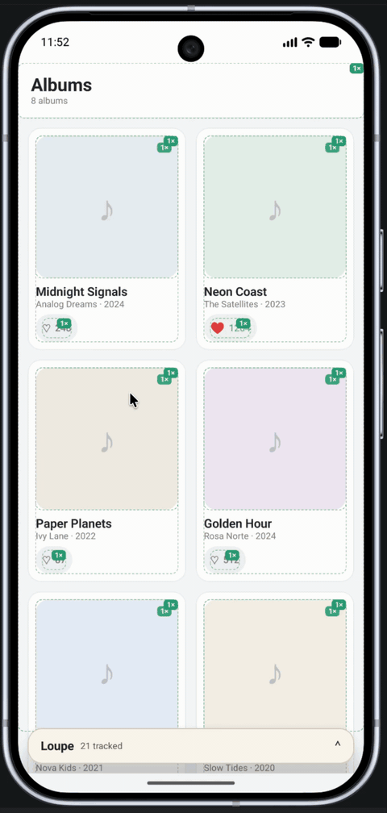
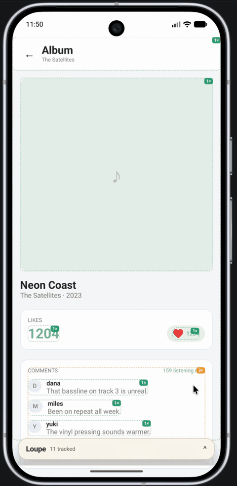
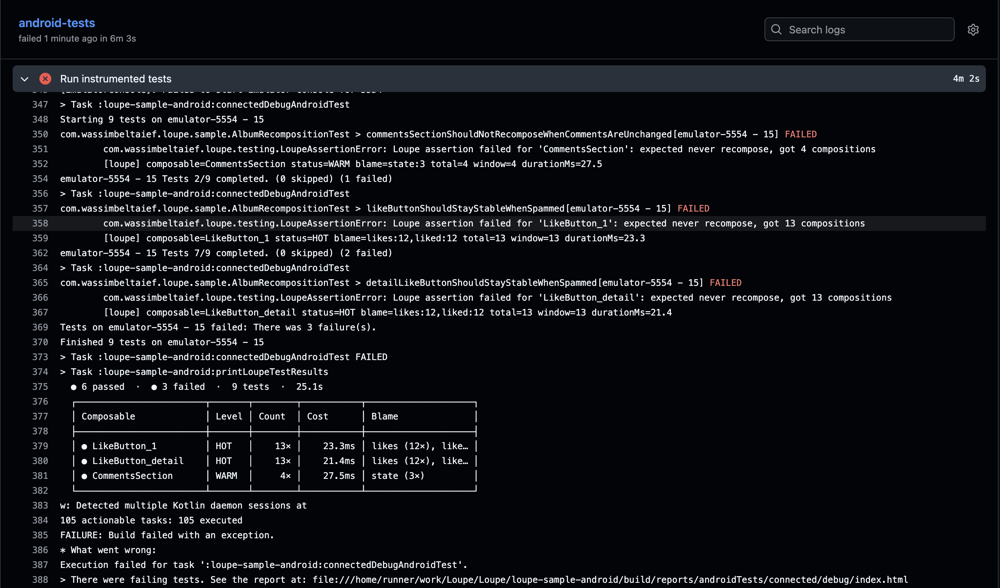

# Loupe

**See _why_ your Compose UI recomposes — on device, with one dependency.**

Add a single `debugImplementation`, and Loupe instruments every composable for you: a live overlay ranks the hottest ones, and the drill-down tells you exactly which parameter (or local state) caused each recomposition. No code changes, no Android Studio, no USB.

<table>
  <tr>
    <th align="center" width="50%">Happy path</th>
    <th align="center" width="50%">Unhappy path</th>
  </tr>
  <tr>
    <td align="center" valign="top">
      
    </td>
    <td align="center" valign="top">
      
    </td>
  </tr>
  <tr>
    <td valign="top">
      Loupe makes it easy to see at a glance when things are good: the screen is healthy and skipping as intended.
    </td>
    <td valign="top">
        Loupe makes it just as easy to see when things are bad: the wasted work stands out instead of hiding.
    </td>
  </tr>
</table>

## What you get

- **Live overlay:** on-screen composables ranked by recomposition count and cost, with proportional bars.
- **Drill-down:** tap a row for a burst-grouped timeline, per-parameter blame (`changed`, `lambda`, `MutableList`, `state`) and 💡 fix suggestions.
- **Local state changes:** `counter 0 → 1` shows when a composable recomposes because of its own `remember { mutableStateOf(...) }`.
- **Share with QA:** export the full history as JSON to Slack/Jira. No developer needed to reproduce the issue.
- **Heatmap (opt-in):** coloured borders and count badges drawn over the composables on screen.

## Install

```kotlin
// app/build.gradle.kts
plugins {
    id("com.wassimbeltaief.loupe") version "1.0.1"
}

loupe {
    packageFilter.set(listOf("com.mycompany.myapp"))
}

dependencies {
    debugImplementation("com.wassimbeltaief:loupe-runtime:1.0.1")
}
```

```kotlin
// Application
override fun onCreate() {
    super.onCreate()
    LoupeRuntime.install(this)
}
```

The compiler plugin only touches **debug builds** — release artifacts are untouched. The overlay needs the `SYSTEM_ALERT_WINDOW` permission; Logcat prints the exact `adb` command if it is missing.

Heatmap borders are the only opt-in part — wrap your content once:

```kotlin
LoupeHeatmapHost { App() }
```

## Testing recompositions

Loupe's data is available to tests through the `loupe-testing` artifact, so a
recomposition budget can fail a build before a regression ships.

### Setup

Add the testing dependency to your instrumented tests and tag the composables
you want to assert on:

```kotlin
// app/build.gradle.kts
dependencies {
    androidTestImplementation("com.wassimbeltaief:loupe-testing:1.0.1")
}
```

```kotlin
Column(modifier = Modifier.testTag("ProductCard")) { /* … */ }
```

Then use `LoupeTestRule` in place of `createComposeRule()`. It resets the
recorder before every test and turns the overlay, heatmap and Logcat off, so it
is safe to run in CI:

```kotlin
@get:Rule
val rule = LoupeTestRule()

@Test
fun productCardIsStable() {
    rule.setContent { App() }
    rule.waitForIdle()
    rule.onNodeWithTag("ProductCard").shouldNeverRecompose()
}
```

Pass a config to align the report's HOT/WARM bands with the overlay:
`LoupeTestRule(config = LoupeConfig(hotThreshold = 10, warmThreshold = 3))`.

### Which method for what

| You want to assert | Method | Composition count |
|---|---|---|
| It never recomposed | `shouldNeverRecompose()` | exactly 1 |
| It recomposed once | `shouldRecomposeOnce()` | exactly 2 |
| An exact budget | `shouldRecompose(times(n))` | exactly n |
| An upper budget | `shouldRecompose(atMost(n))` | at most n |
| A lower bound | `shouldRecompose(atLeast(n))` | at least n |
| A cost budget | `maxRecompositionTimeInMs(ms)` | total ≤ ms |

The count is the **total number of compositions, including the initial one**.
`times(1)` means "composed once, never recomposed"; 12 clicks that each change
the data are `shouldRecompose(atMost(13))` — initial plus one per click.

How a tag becomes a history: `Modifier.testTag("ProductCard")` first matches the
composable's full Loupe key (e.g. `ProductCardKt.ProductCard`), then falls back
to a suffix match on the function name, and prefers a per-instance entry when
several instances share the name.

### What you get on failure

A failing assertion throws a `LoupeAssertionError` carrying the blame and cost
for the composable under test, and the end of the run prints one compact report —
in Logcat on device and in the Gradle console in CI:

```
  6 passed  ·  3 failed  ·  9 tests  ·  25.1s

  ┌────────────────────────┬───────┬────────┬──────────┬────────────────────┐
  │ Composable             │ Level │ Count  │ Cost     │ Blame              │
  ├────────────────────────┼───────┼────────┼──────────┼────────────────────┤
  │ ● LikeButton_1         │ HOT   │   13×  │  23.3ms  │ likes (12×), li…   │
  │ ● LikeButton_detail    │ HOT   │   13×  │  21.4ms  │ likes (12×), li…   │
  │ ● CommentsSection      │ WARM  │    4×  │  27.5ms  │ state (3×)         │
  └────────────────────────┴───────┴────────┴──────────┴────────────────────┘
```

`Level` uses the same bands as the overlay: `HOT` at or above `hotThreshold`,
`WARM` at or above `warmThreshold`, `OK` otherwise. `Blame` is the parameter (or
local state) that drove the recompositions.

### In CI

The sample runs these tests on a hardware-accelerated emulator in GitHub Actions
and prints the table in the job log. The `printLoupeTestResults` task is wired as
a finalizer of `connected*AndroidTest`, so the report is emitted even when the
tests fail:



## Feedback

Bugs, questions and ideas: [open an issue](https://github.com/WassimBeltaief/Loupe/issues).
