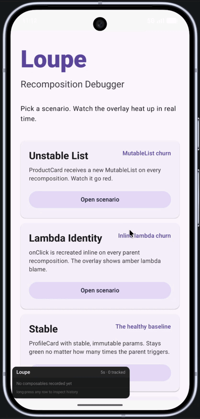

# Loupe

A zero-instrumentation recomposition debugger for Jetpack Compose.

Add one `debugImplementation` dependency and get a live on-device overlay that tracks every composable on screen, shows how many times it recomposed, and tells you exactly which parameter caused it — no Android Studio, no USB cable, no code changes required.

<br/>



<br/>

## Installation

```kotlin
// build.gradle.kts (app module)
plugins {
    id("com.wassimbeltaief.loupe") version "1.0.0-alpha01"
}

loupe {
    packageFilter = listOf("com.mycompany.myapp")
}

dependencies {
    debugImplementation("com.wassimbeltaief:loupe-runtime:1.0.0-alpha01")
}
```

Then initialise in your `Application`:

```kotlin
class MyApplication : Application() {
    override fun onCreate() {
        super.onCreate()
        LoupeRuntime.install(this)
    }
}
```

That's it. The compiler plugin instruments your `@Composable` functions at IR level on **debug builds only** — release artifacts are untouched. The overlay appears automatically (requires the standard `SYSTEM_ALERT_WINDOW` permission; Logcat tells you the exact `adb` command if missing).

<br/>

## Features

| Feature | Status |
|---|---|
| Live overlay — ranked hottest composables, proportional bars, cost in ms | ✅ Shipped |
| Accurate counting — skipped invocations are never counted (anchored inside Compose's restart group) | ✅ Shipped |
| Drill-down panel — tap any row: burst-grouped timeline, per-param verdict chips, 💡 suggestions | ✅ Shipped |
| Parameter blame bar — ranked by recomposition contribution, lambda identity never shown as critical | ✅ Shipped |
| Share report / Copy JSON — full history export from the drill-down, QA-ready | ✅ Shipped |
| `@LoupeRedact` + automatic email/credit-card redaction | ✅ Shipped |
| Forced-recomposition disambiguation in the timeline | ✅ Shipped |
| CI testing API — `record {}`, `assertMaxRecompositions()`, `assertStable()` | ✅ Shipped |
| Logcat output mode (standard + verbose) | ✅ Shipped |
| Heatmap borders over on-screen composables | Post-alpha ([#13](https://github.com/WassimBeltaief/Loupe/issues/13)) |
| Documentation site | Post-alpha ([#27](https://github.com/WassimBeltaief/Loupe/issues/27)) |

<br/>

## Drill-down: the QA workflow

1. QA notices jank on a screen and taps the hot (red) row in the Loupe overlay.
2. The drill-down sheet opens: full recomposition timeline grouped into bursts, each parameter tagged (`MutableList`, `lambda`, `unstable`, `unchanged`), suggestions inline.
3. They tap **Share report** — the JSON history goes straight to Slack/Jira.
4. You read the exact param-level cause without reproducing anything.

<br/>

## CI testing API

Enforce recomposition budgets in instrumented tests — a build fails on regression:

```kotlin
@Test
fun productCard_recompositionBudget() {
    val report = LoupeRuntime.record {
        composeTestRule.setContent { ProductCard(price = 19.99, title = "Widget", onClick = {}) }
        composeTestRule.onNodeWithText("Buy").performClick()
        composeTestRule.waitForIdle()
    }
    report.assertMaxRecompositions(maxCount = 3)
    report.assertNoBlamedLambdas("ProductCard")
}
```

Also: `assertMaxRecompositionCost()`, `assertStable()`, `toJson()`, `printSummary()` with a top-blame column.

<br/>

## Privacy

Nothing leaves the device unless someone explicitly taps **Share**. Parameter values are truncated to 120 chars; `String` params matching email or credit-card patterns are auto-redacted. For anything else:

```kotlin
@LoupeRedact
data class UserSession(val token: String, val userId: String)
```

Values of `@LoupeRedact`-annotated types are replaced with `"[redacted]"` at the call site — they never reach the registry.

<br/>

## Configuration

```kotlin
LoupeRuntime.install(this, LoupeConfig(
    overlayPosition = OverlayPosition.BottomEnd,
    hotThreshold = 16,          // red at ≥16 recompositions per window
    warmThreshold = 4,          // amber at ≥4
    windowSeconds = 5,
    logcatEnabled = true,       // summary blocks when a composable heats up
    logcatVerbose = false,      // + every individual recomposition
))
```

<br/>

## How it works

A Kotlin compiler plugin (`build-logic/loupe-plugin`) instruments every eligible `@Composable` at IR level: it prepends a `LoupeRuntime.record(...)` call — lambdas captured as `LambdaRef(identityHashCode)` — reads local `MutableState` values via `trackState(...)`, and wraps the body in `try/finally` for duration measurement. The Gradle plugin applies it to debuggable variants only. The runtime diffs parameters and state per recomposition, ranks blame, and renders the overlay in a `WindowManager` layer above your app.

See [CLAUDE.md](CLAUDE.md) for the full architecture and design contracts.

<br/>

## Limitations

- **Parameters and local `MutableState`.** Loupe captures composable parameters plus local `remember { mutableStateOf(...) }` reads, shown as `state` rows (e.g. `counter 0 → 1`) instead of an unexplained forced recomposition. Other internal triggers — side-effect-driven invalidation, a non-restartable parent — still surface as `no param change` with the likely cause explained.
- **Heatmap is opt-in.** Borders and badges need the composition tree, so they require wrapping app content once with `LoupeHeatmapHost { }` (debug builds only). Everything else works with zero code changes.
